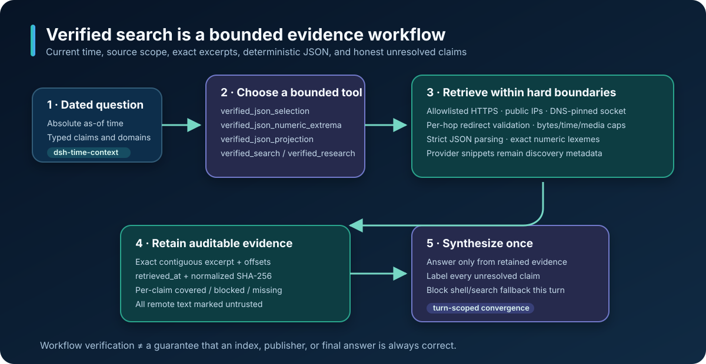
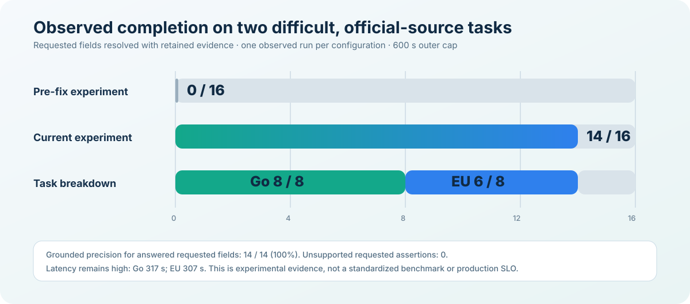

# dsh-plugin-verified-search

[English](README.md) · [繁體中文](README.zh.md)

An installable DeepSeek Harness plugin for current/latest/as-of searches that need explicit source scope and honest evidence gaps.

This project is the immediately installable companion to [deepseek-harness Discussion #332](https://github.com/deepseek-ai/deepseek-harness/discussions/332). It does not claim that a search index is always current. It makes the retrieval procedure and returned structured-source boundary auditable.



> **Unreleased experiment:** `main` currently carries the `0.3.0-experiment.0` composite and structured-selection workflows described below. They are not part of the reviewed `v0.1.1` release tag used by the stable installation command in this document. Pin a commit when testing unreleased code.

## What it changes

- Adds a model-facing `verified_search` tool with `query` and optional `allowed_domains`.
- Mounts Harness rc.6's built-in durable `dsh-time-context` every 60 seconds, covering the composition omission reported in [Discussion #344](https://github.com/deepseek-ai/deepseek-harness/discussions/344).
- Hides and blocks the inherited legacy `web_search` for agents covered by the plugin.
- After a successful structured JSON operation, hides and blocks every intermediate tool except `verified_research`; the agent must answer or proceed directly to one bounded research pass.
- Requires absolute-date queries for mutable facts, a first-party allowlisted pass, and a separate unrestricted comparison pass.
- Calls DeepSeek's Anthropic-compatible Messages endpoint with native `web_search_20250305`.
- Records the exact credential-free auxiliary request before dispatch using Harness's persistence-known `web/deepseek-search-llm-request` event. The search query itself is durable session data, so never put a secret in it.
- Normalizes 1–20 bare ASCII hostnames and rejects schemes, paths, ports, wildcards, Unicode hostnames, and IP literals, including legacy IPv4 forms.
- Sends `allowed_domains` to DeepSeek, echoes it in the auxiliary prompt, and locally removes non-matching structured sources before capping results.
- Rejects credential-bearing source URLs and removes sensitive/tracking query parameters plus fragments before results enter tool/session logs.
- Joins citation excerpts to sources and exposes missing excerpts instead of treating a title or URL as verified content.

## Experimental `verified_research`

`verified_search` remains the narrow, single-query lookup. The experimental `verified_research` tool handles comparisons and other questions that need several independently covered facts:

- accepts one to four typed lanes, each with one to six required model-facing `required_claims`, optional `allowed_domains`, up to two caller-selected `seed_urls`, and one required model-facing `gap_query`; the request-wide claim cap is 24, matching the complete four-lane schema rather than imposing a hidden lower runtime limit (the direct TypeScript API alone retains its deprecated implicit-claim compatibility path);
- requires every explicit claim to declare 1–8 bounded `evidence_must_include` phrases; every phrase must match the final exact excerpt as a case-insensitive, whitespace/control-normalized substring before the claim can be marked covered;
- requires every model-facing claim to declare `value_kind`: `generic_text`, `cvss_assigned_version`, `cvss_vector`, or `cvss_base_score`; CVSS kinds require a concrete metric block rather than UI tabs or generic prose;
- requires every explicit claim to declare a typed `scope`: document scopes bind page-global candidate-neutral identity markers and may bind a document `year_month`, while event-row scopes require row-local markers plus either an exact event `year_month` or `after` plus `select: first`; rows containing metadata labels such as `Released` and `Last Update` cannot satisfy an event anchor;
- checks seed URLs before discovery, searches only lanes with remaining claim gaps, and completes every search round before starting any gap retry, with at most two concurrent searches and `max_uses` capped at two per auxiliary request;
- safely fetches selected public HTTPS pages instead of treating provider titles or snippets as proof;
- skips discovery URLs with known unsupported binary paths such as `/printable/pdf`, `.pdf`, Office archives, and `.zip` before choosing the next text candidate; an explicit binary seed still fails visibly instead of being silently reinterpreted;
- can directly check a caller-supplied allowlisted page even when provider discovery returns no candidates; this does not prove the URL is canonical or first-party;
- extracts at most one exact, contiguous excerpt per declared claim with offsets, retrieval time, and the SHA-256 of normalized page text, and renders the complete bounded excerpt as a JSON string so its original line and section boundaries survive without a second crop;
- reserves a model-visible evidence source for every covered claim; one page can cover several claims without consuming extra source slots;
- reports per-claim status, `unresolvedClaims`, `allClaimsCovered`, seed terminal states, fetch errors, and out-of-scope source counts; `allLanesFetched` remains a deprecated alias;
- runs `gap_query` while any declared claim remains unresolved, then defers a value-free terminal-synthesis instruction and concludes the tool turn;
- blocks every later tool call in the same turn, then clears at the durable `turn/end` boundary (with idle as a cancellation fallback), so shell, Python, `run_code`, MCP, or another search cannot bypass the bounded result without contaminating an already queued next turn.

Example composite call:

```json
{
  "query": "Identify the current flagship API model IDs as of 2026-08-14",
  "lanes": [
    {
      "id": "deepseek",
      "query": "DeepSeek current flagship API model ID as of 2026-08-14",
      "required_claims": [
        {"id": "model_id", "query": "latest DeepSeek flagship API model identifier", "evidence_must_include": ["Model ID"], "value_kind": "generic_text", "scope": {"kind": "document", "must_include": ["DeepSeek"]}},
        {"id": "context", "query": "that model context-window size", "evidence_must_include": ["Context"], "value_kind": "generic_text", "scope": {"kind": "document", "must_include": ["DeepSeek"]}}
      ],
      "allowed_domains": ["api-docs.deepseek.com"],
      "seed_urls": ["https://api-docs.deepseek.com/api/list-models/"],
      "gap_query": "site:api-docs.deepseek.com/api/list-models DeepSeek model IDs 2026-08-14"
    },
    {
      "id": "openai",
      "query": "OpenAI current flagship API model ID as of 2026-08-14",
      "required_claims": [
        {"id": "model_id", "query": "latest OpenAI flagship API model identifier", "evidence_must_include": ["Model ID"], "value_kind": "generic_text", "scope": {"kind": "document", "must_include": ["OpenAI"]}},
        {"id": "context", "query": "that model context-window size", "evidence_must_include": ["Context window"], "value_kind": "generic_text", "scope": {"kind": "document", "must_include": ["OpenAI"]}}
      ],
      "allowed_domains": ["developers.openai.com"],
      "seed_urls": ["https://developers.openai.com/api/docs/models"],
      "gap_query": "site:developers.openai.com/api/docs/models flagship model ID 2026-08-14"
    }
  ]
}
```

The full-page reader is deliberately narrow: HTTPS on port 443, DNS hostnames only, public IPs only, a DNS-pinned socket, same-origin redirects with validation on every hop, supported text/JSON media types, identity encoding, and bounded redirects, bytes, and time. Undeclared text and declared UTF-8 are decoded with fatal UTF-8 validation; the explicitly declared web labels `ISO-8859-1` and `windows-1252` use the WHATWG Windows-1252 decoder for first-party advisories such as Cisco's. Unknown, malformed, or duplicate charset declarations fail closed. Scripts and common non-content HTML regions are removed before inert text extraction. Fetched excerpts are still untrusted web content and are evidence candidates, not automatic entailment decisions.

`evidence_must_include` is a mechanical postcondition, not a regex or semantic judge. Matching lowercases both sides, canonicalizes common curly quotes and dash variants, collapses Unicode whitespace and controls, and performs a substring check; `matchedRequiredPhrases` therefore reports the caller-declared phrases, not byte-exact text copied from the page. Use candidate-neutral field labels, action phrases, or date markers that an answer-bearing passage must contain; do not put an expected unknown answer into a query or phrase merely to confirm the model's own guess. For document scope, `scope.must_include` is a page-global document-identity check; every `evidence_must_include` phrase must still occur in the retained excerpt. For event-row scope, `scope.must_include` remains row-local. A document temporal anchor verifies the declared month against the URL or document header. An event-row anchor recognizes ISO dates or full English month names with same-month day ranges, inherits years only from recognized English calendar/event headings or a bare year, rejects rows containing recognized metadata labels, and can select the first successfully parsed event after an exclusive cutoff. This is not a general table parser and does not prove that every upstream event row was parsed. Missing and blocked claim queries are deliberately not repeated in the model-facing result, because tool arguments are not evidence.

`value_kind` adds a bounded value-shape postcondition. The three CVSS modes accept only a concrete assigned version tied to a valid vector or labelled base score, a complete CVSS v3/v4 vector (or explicitly labelled complete v2 vector), or a numeric labelled base score from 0.0 through 10.0 with one concrete version. They deliberately reject NVD's generic version tabs and prose about “vector strings.” This remains a shape check, not independent validation that the publisher calculated the metric correctly.

Queries that explicitly ask for affected, fixed, or patched version/release lists also require a concrete dotted version near a recognized list label such as `Hot Fix Name`, `Patched Versions`, or `Affected Versions`. A cross-reference to a “Fixed Software” section, a software-checker input example, or a sentence that merely recommends a fixed release cannot by itself mark the list covered.

The only cross-origin representation exception is an HTTP 202 from the exact original EUR-Lex English legal-content request with one strict `uri=CELEX:...` value and no other query field. The lane must explicitly allow both `eur-lex.europa.eu` and `publications.europa.eu`; only then can the reader derive the matching official Publications Office `/resource/celex/` resolver. That exact resolver must return HTTP 303 to `http(s)://publications.europa.eu/resource/cellar/<safe-id>/DOC_<n>` with no query or fragment. HTTP is upgraded to HTTPS only in this resolver state, and the exact document must return HTTP 200 `application/xhtml+xml` without another redirect. Both state transitions consume the redirect budget. Generic 202 responses and every other cross-origin or HTTP redirect remain blocked. This retrieves another official representation; it does not prove that the text is the latest consolidated law or that an excerpt entails a legal conclusion.

## Experimental `verified_json_projection`

Use `verified_json_projection` for a canonical JSON object-array when the task needs every strict matching row in source order, rather than a date or numeric extreme. It projects 1-32 scalar string/boolean/null fields from each matching parent row and may project one row-relative nested array with its own strict filters and fields. Both levels retain the original zero-based `sourceIndex`, exact `rowCount` and `matchCount`, and all matches within the shared row/output bounds. It never sorts or infers a latest row.

Pointer handling is bounded and auditable. If the fetched root is already an array and a non-empty `array_pointer` cannot resolve, the tool may use that root array and records `root_array_fallback`. After an exact object-key miss, each segment may repair only one unique ASCII case-insensitive key; ambiguous keys, non-ASCII case guesses, and different effective repairs across inspected rows fail closed. `pointerAudits` and the model-visible `pointer_audits_json` preserve every requested pointer, effective pointer, and repair. Values, filters, ordering, and field aliases are never repaired or inferred.

The tool deliberately rejects numeric equality filters and every projected JSON number because ordinary `JSON.parse` cannot preserve number lexemes beyond IEEE-754 precision. Use `verified_json_numeric_extrema` when numeric comparison or exact numeric projection is required. `complete: true` covers only the selected arrays in the fetched response; it does not prove that an upstream API returned every page or that source order has semantic meaning. Projected strings are rendered completely within the 64 KiB scalar and aggregate output limits rather than silently cropped.

## Experimental `verified_json_selection`

Use `verified_json_selection` for official machine-readable feeds when a task asks for a latest/as-of maximum or every same-date tie. It requires `source_url` and `allowed_domains`, fetches `application/json`, and performs a bounded deterministic operation:

1. resolve `array_pointer` as RFC 6901 (an empty pointer may select a root array);
2. optionally apply one to four strict string/boolean/null `where` equality filters;
3. retain rows whose ISO date or UTC RFC 3339 timestamp at `filter.pointer` is on or before `filter.lte`;
4. select the maximum calendar day at `max.pointer`, retaining every final tie;
5. return only 1–32 requested scalar projections.

The network reader caps the fetched feed at 2 MiB. The pure selector API additionally caps direct input at 8 MiB, the selected array at 25,000 rows, final ties at 256, each projected scalar at 64 KiB, projected-output construction at 4 MiB, and successful serialized output at 8 MiB. It scans depth, duplicate keys, and Unicode before `JSON.parse` can materialize the document. Invalid JSON, duplicate keys, invalid pointers/dates, missing fields, no match, and limit violations fail closed without a partial success.

`complete: true` and `truncated: false` mean only that the specified operation completed over the accepted UTF-8 JSON input and retained all final ties within those limits. `evidenceSha256` hashes the accepted input bytes (the fetched decoded body for the network tool); it is not a signature, raw HTTP-body attestation, publisher authentication, or proof that the feed is complete or factually correct. A semantic flag such as `is_latest=true` should be expressed with `where`; the most recently published row is not automatically the newest product version.

After any successful root structured JSON projection or selection, the same-turn policy leaves only `verified_research` in the next model header and rejects direct dispatch of every other tool. A task may finish immediately or proceed to that single bounded research pass for remaining first-party claims. This is a convergence boundary: it prevents shell, browser, alternate structured-tool, and title/URL-discovery detours between deterministic feed processing and bounded full-page research, but it does not force a research pass when the JSON result already answers the task.

## Experimental `verified_json_numeric_extrema`

Use `verified_json_numeric_extrema` when an official JSON object-array asks for a numeric maximum or minimum and every tied row. It keeps the existing date selector separate and performs a bounded numeric operation:

1. resolve an RFC 6901 `array_pointer` and optional strict `where` filters;
2. optionally retain rows on or before an inclusive ISO-date cutoff;
3. compare the JSON number at `extreme.pointer` as its exact source lexeme, without IEEE-754 conversion;
4. select `direction: "max"` or `"min"` with `ties: "all"`;
5. project bounded scalar fields, representing every projected JSON number as `{ "jsonNumber": "<exact source lexeme>" }`.

The selector normalizes sign, significant digits, and base-10 scale for comparison, so values such as `1`, `1.0`, and `1e0` tie without discarding their original representations. It fails closed when the running Node runtime cannot expose a number token's source text. Additional bounds cap the number of numeric tokens at 100,000 and each numeric lexeme at 1,024 bytes; the feed, row, tie, projection, depth, and successful-output limits remain bounded as described above.

`ties: "all"` covers only the fetched selected array. It does not prove that an upstream API returned its whole corpus, that pagination was exhausted, or that the publisher's numeric field has the intended unit or semantics. Use `where` and the cutoff to encode those boundaries explicitly, cite `source_url`, and report `retrieved_at`.

## Observed evaluation



The current experiment was exercised on two different difficult searches with frozen requested-field ledgers:

| Task | Before the fixes | Current experiment | Terminal time |
| --- | ---: | ---: | ---: |
| Go supported releases, security scope, and Linux artifact provenance | 0/8 | **8/8** | 317 s |
| EU AI Act amended timeline and GPAI transition dates | 0/8 | **6/8** | 307 s |
| **Combined** | **0/16** | **14/16 (87.5%)** | — |

All 14 answered requested fields were grounded in retained official-source evidence, and no unsupported requested field was asserted. The two unresolved EU fields were reported as unresolved. The earlier stock rc.6 runs also reached the 240-second outer limit without a terminal answer, while the current runs required more than 240 seconds. These are single observed runs under a 600-second outer cap—not a standardized benchmark, statistical estimate, or production latency target.

## Install

Install the reviewed stable release tag:

```powershell
dsh plugin --profile web add github:f0909172434/dsh-plugin-verified-search#v0.1.1
dsh --profile web --dump-config
dsh web
```

To evaluate the unreleased v0.3 workflow, pin the exact experimental commit rather than installing a moving branch:

```powershell
dsh plugin --profile web add github:f0909172434/dsh-plugin-verified-search#67d337ebb754b51b703df3f690310482c0f2d14d
dsh --profile web --dump-config
dsh web
```

The repository commits its reviewed `lib/` output and has no install-time build script. A pinned Git install therefore does not require `allowBuilds` or execute this package's development toolchain on the user's machine.

The plugin retrofits live search-capable agents on load. An already in-flight model request keeps its frozen tool header; the replacement appears on the next assembly. Presets that do not expose `web_search` (including the shipped `minimal` preset) receive no new capability.

If the deployment already includes Discussion #344's `time-context` row, set `DSH_VERIFIED_SEARCH_DISABLE_TIME_CONTEXT=1` before starting Harness to avoid two clock injectors. The plugin targets stock rc.6; remove it or disable this row when the official core fixes land.

To roll back, remove the bundle and restart Harness:

```powershell
dsh plugin --profile web remove dsh-plugin-verified-search
dsh web
```

## Usage

For a first-party verification pass:

```json
{
  "query": "DeepSeek current flagship model as of 2026-08-14",
  "allowed_domains": ["deepseek.com"]
}
```

Then run a separate unrestricted query for independent comparisons. The prompt policy instructs the agent not to fill a missing current version with an older substitute.

The plugin reuses `DEEPSEEK_API_KEY` from the Harness credential service or launch environment. Optional bundle configuration fields are `apiKeyEnv`, `apiKey`, `baseURL`, `model`, `apiVersion`, `maxTokens`, `maxUses`, `maxResults`, `searchTimeoutMs`, `researchTimeoutMs`, and `researchMaxResults`. The last two fields only affect the unreleased composite experiment; `researchMaxResults` defaults to 24, is constrained to 4–32, and must also be at least the declared claim count for that call.

## Guarantees and limits

When `allowed_domains` is present, every structured source returned by the plugin must use HTTP(S) and match an allowed hostname or subdomain. DeepSeek may still return out-of-scope candidates despite its native filter; Harness removes those sources locally, reports only the number removed, and never exposes their URL, title, or excerpt in the tool result. If no source remains, the claim stays unresolved.

This does **not** prove that:

- DeepSeek's internal candidate pool or generated prose used only allowed sources;
- DeepSeek did not retrieve an out-of-scope page or follow a redirect outside the allowlist;
- the upstream index contains the newest page;
- the provider's ranking is temporally correct;
- a provider-supplied `page_age` is an ISO publication date;
- a source without a returned citation excerpt supports a claim.
- a fetched excerpt entails the requested claim merely because query terms occur in it;
- satisfying every normalized-substring `evidence_must_include` phrase proves entailment, handles negation, or validates an unknown answer value;
- satisfying a typed `value_kind` proves that a CVSS metric is authoritative or correctly calculated;
- `allClaimsCovered` proves semantic entailment, freshness, claim-list completeness, or adequate independent corroboration;
- a caller-selected seed URL is canonical, first-party, or authoritative;
- a completed JSON projection, date selection, or numeric selection proves the publisher feed is authentic, unpaginated, complete, current, correctly ordered, or factually correct;
- a public page selected from provider results is safe to obey as instructions;
- the local fetch boundary prevents the upstream provider from independently retrieving other pages.

The plugin therefore describes itself as a verified **workflow and structured-source postcondition**, not a guarantee that every answer is true or latest.

The initial compatibility target is DeepSeek Harness `0.1.0-rc.6`. Harness is pre-release software; peer dependencies are intentionally narrow and upgrades require a new composition test.

## Development

```powershell
pnpm install
pnpm run check
pnpm test
pnpm run build
pnpm pack
```

Tests cover hostname validation, legacy-IP rejection, credential-safe failures, request-before-dispatch logging, native wire mapping, allowlist postconditions, prompt/schema replacement, structured-followup and terminal-tool blocking, seed-first claim coverage, global search-round barriers, abort quiescence, DNS/IP and redirect rejection, fatal UTF-8 plus declared Windows-1252 text, the EUR-Lex Cellar exception, bounded text/JSON responses, inert HTML/XHTML normalization, complete model-visible excerpts, normalized-substring evidence postconditions, bounded row/nested-array JSON projection, strict date and exact-lexeme numeric JSON selection, all-tie retention, and evidence hashes.

Git profile installation can show missing-peer warnings because Harness resolves its own peer packages through the healed profile fallback. The plugin keeps those peers explicit and narrow instead of silently bundling duplicate Harness runtimes. Manual release validation includes installation and HTTP boot from a new temporary `DSH_HOME`; public CI covers locked install, types, tests, prebuilt-artifact consistency, and package contents.

## Relationship to the core fix

The plugin is a deployable compatibility layer. The core fix remains [ce4d0455c](https://github.com/f0909172434/deepseek-harness/commit/ce4d0455c637e5ba91fbb7b3a88725e7ec097371), which evolves the provider-neutral `ctx.web` contract and all built-in providers. If the official project merges that work, this plugin can switch to an additional verification mode or retire.

## License

MIT

## Security

Please report a suspected credential leak, allowlist bypass, or unsafe page-fetch path privately through GitHub's security-advisory interface, which is enabled for this repository. Do not paste API keys, signed URLs, search queries containing private data, fetched excerpts containing private data, or raw session logs into a public issue.
