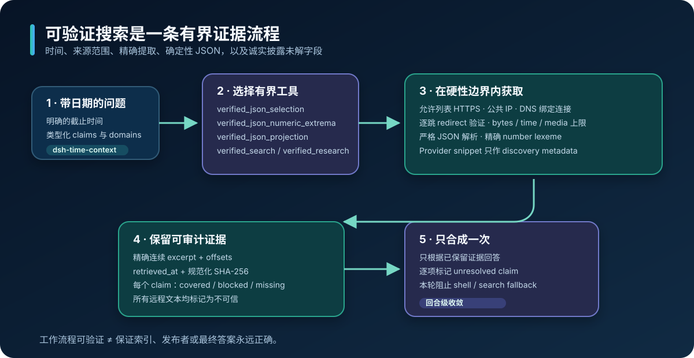
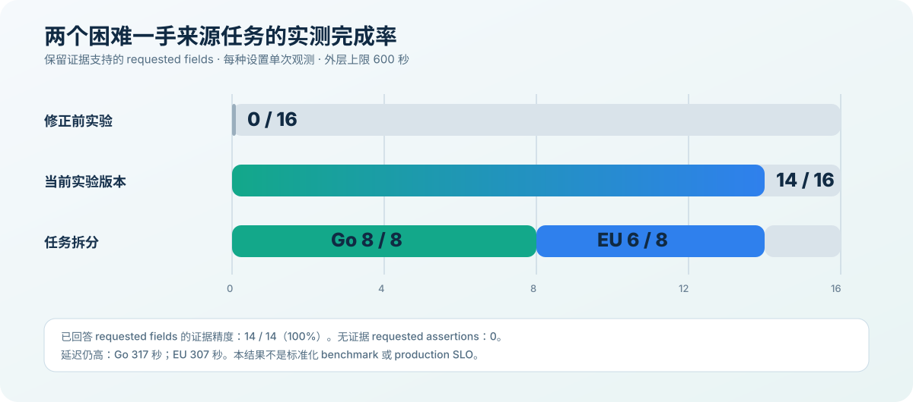

# dsh-plugin-verified-search

[English](README.md) · [繁體中文](README.zh.md) · [简体中文](README.zh-CN.md)

这是一个可直接安装到 DeepSeek Harness 的社区插件，专门处理“当前、最新、截至某日”等需要明确来源范围并诚实披露证据缺口的搜索。

本项目是 [deepseek-harness Discussion #332](https://github.com/deepseek-ai/deepseek-harness/discussions/332) 的可部署配套。它不宣称搜索索引永远最新，也不把模型生成的摘要当作证据；它让搜索流程、来源边界、提取内容与未解字段都可以被审计。



> **尚未发布的实验版本：** `main` 当前包含 `0.3.0-experiment.0` 的复合研究与结构化 JSON 工具。这些功能不属于已审查的 `v0.1.1` 稳定标签。测试未发布代码时，请固定到明确 commit，不要依赖会移动的分支。

## 它解决什么

DeepSeek Harness rc.6 原本的 `web_search` 只有一个 `query`，另一个独立的 Flash 模型再决定是否搜索以及如何生成子查询。默认组合也没有完整页面读取，因此主 agent 经常只能看到标题和 URL；“最新模型比较”可能因此混入旧版本，却没有足够内容可供验证。

此外，Harness 已经提供 `dsh-time-context`，但 rc.6 的默认 composition 没有挂载它；这正是 [Discussion #344](https://github.com/deepseek-ai/deepseek-harness/discussions/344) 指出的时间上下文缺口。

本插件会：

- 每 60 秒挂载 Harness 内置的 `dsh-time-context`；
- 对有搜索能力的 agent 隐藏并阻止旧 `web_search`，但不为 `minimal` preset 扩权；
- 提供 `verified_search`、`verified_research` 和三个有界 JSON 工具；
- 规范化 1–20 个裸 ASCII hostname，拒绝 scheme、path、port、wildcard、Unicode hostname 和 IP literal；
- 将 `allowed_domains` 传给 provider，同时在本地对返回的结构化来源执行 hostname postfilter；
- 在来源进入工具结果或 session 前移除 URL credential、敏感／跟踪 query 参数与 fragment；
- 将搜索 query 和 credential-free request envelope 先写入 Harness 已知的 durable event，再发送 provider request；
- 将所有远程标题、URL、excerpt 和 JSON scalar 明确标为不可信数据；
- 在有界研究完成后阻止同一 turn 的 shell、Python、其他搜索或 MCP fallback，要求 agent 直接回答并逐项列出 unresolved claims。

## 工具一览

| 工具 | 适合的任务 | 可验证边界 |
| --- | --- | --- |
| `verified_search` | 单一、狭窄、会变化的查询 | 返回的结构化来源 URL 符合 allowlist；缺少 excerpt 时降低置信度 |
| `verified_research` | 多来源、多实体、多字段比较 | 每个 covered claim 都保留一段完整、连续、模型可见的提取文本与 hash |
| `verified_json_selection` | 官方 JSON feed 的截止日期最大值与同日 ties | 严格 RFC 6901、日期 cutoff、最大日期、所有 final ties |
| `verified_json_numeric_extrema` | JSON 数值最大／最小与全部 ties | 使用来源中的精确 number lexeme，比较不经过 IEEE-754 |
| `verified_json_projection` | 按来源顺序投影全部严格匹配行和一层 nested array | 不排序、不猜 latest；pointer repair 必须唯一并完整记录 |

## `verified_research` 的证据契约

一次调用可以包含 1–4 个 lane，每个 lane 1–6 个 claim，总计最多 24 个 claim。每个 lane 应提供：

- 明确的 `allowed_domains`；
- 最多两个已知的一手 `seed_urls`；
- 一条与首次 query 不同、且不包含待验证答案候选值的 `gap_query`；
- 每个 claim 的 `query`、`evidence_must_include`、`value_kind` 和 typed `scope`。

`evidence_must_include` 不是 regex，也不是语义裁判。它会规范化大小写、Unicode 空白、常见弯引号与 dash 变体，然后要求每个指定短语都出现在最终保留的 excerpt 中。不要把未知答案本身放进短语，否则只是在让模型确认自己的猜测。

`scope` 有两种：

- `document`：使用 page-global 的候选中立标记确认文档身份，也可以绑定 `YYYY-MM` 文档月份；
- `event_row`：要求 row-local 标记，并按指定月份或 `after + select:first` 选择事件行。包含 `Released`、`Last Update` 等 metadata label 的行不能冒充事件日期。

每个 covered claim 最多保留一段完整、连续且不超过 2,000 字符的 excerpt，并附带：

- `excerptStart` / `excerptEnd`；
- `retrievedAt`；
- normalized page text 的 SHA-256；
- claim status：`covered`、`blocked` 或 `missing`。

Provider snippet 只用于 discovery，不能升级为已验证证据。

### 安全的完整页面读取

页面读取器刻意保持狭窄边界：

- 仅接受 HTTPS 443、DNS hostname，且 URL 不得含 credential；
- DNS 返回的每个 IP 都必须是 public address，并将已验证 IP 绑定到实际 TLS connection；
- 每个 redirect hop 都重新检查 URL、allowlist、DNS 和 IP，普通 redirect 不得跨 origin；
- 限制 redirect 次数、总时间、body idle、bytes、media type 和 content encoding；
- UTF-8 使用 fatal decode；明确声明的 `ISO-8859-1`／`windows-1252` 按 WHATWG 映射，其余 charset fail closed；
- 不执行 script、不携带 cookie、不接受任意 binary 文档；
- discovery 会跳过 `/printable/pdf`、PDF、Office 和 ZIP 路径，明确指定的 binary seed 则保留可见失败。

唯一的跨 origin 例外是精确的 EUR-Lex `uri=CELEX:...` 英文 legal-content request：必须同时 allowlist `eur-lex.europa.eu` 与 `publications.europa.eu`，才能通过官方 Publications Office resolver 获取固定格式的 Cellar XHTML 表示。这个例外由显式状态机约束，不适用于其他 202 或 redirect。

## 结构化 JSON 工具

所有 JSON 工具都先用有界 scanner 检查 depth、duplicate key、UTF-8／Unicode，再由 `JSON.parse` 建立对象。网络 feed 上限为 2 MiB；pure selector API 另有 8 MiB input、25,000 rows、256 ties、64 KiB scalar、4 MiB construction 和 8 MiB output 等限制。

`verified_json_projection` 只投影 string、boolean 或 null。普通 `JSON.parse` 无法保留大型 JSON number 的精确 lexeme，因此 numeric filter／projection 会被拒绝；需要数值比较时请使用 `verified_json_numeric_extrema`。

如果 JSON root 本身是 array，但模型误填了非空 `array_pointer`，projection 可以退回 root array，并在 `pointerAudits` 中记录 `root_array_fallback`。对象 key 只有在“唯一 ASCII case-insensitive match”时才允许修复；歧义、非 ASCII 猜测或不同 row 产生不一致 repair 都会 fail closed。工具不会猜测 value、filter、排序或 field alias。

## 实测结果



本轮使用两个不同领域、预先冻结 requested-field ledger 的困难搜索测试当前版本：

| 任务 | 修正前 | 当前实验版 | Terminal 时间 |
| --- | ---: | ---: | ---: |
| Go 支持线、security fixes 与 Linux artifact provenance | 0/8 | **8/8** | 317 秒 |
| EU AI Act 修法时间线与 GPAI 过渡期限 | 0/8 | **6/8** | 307 秒 |
| **合计** | **0/16** | **14/16（87.5%）** | — |

已回答的 14 个 requested field 全部有保留的一手来源证据，grounded precision 为 14/14；没有输出无证据的 requested assertion。EU 剩余两个字段明确标为 unresolved。这只是 600 秒外层上限下的单次观测，不是标准化 benchmark、统计估计或 production SLO。延迟仍然较高，而且两题都超过 240 秒。

## 安装

安装已审查的稳定标签：

```powershell
dsh plugin --profile web add github:f0909172434/dsh-plugin-verified-search#v0.1.1
dsh --profile web --dump-config
dsh web
```

测试尚未发布的 v0.3 workflow 时，请固定到已验证的实验 commit：

```powershell
dsh plugin --profile web add github:f0909172434/dsh-plugin-verified-search#67d337ebb754b51b703df3f690310482c0f2d14d
dsh --profile web --dump-config
dsh web
```

如果 deployment 已经挂载 Discussion #344 的 `time-context` row，请在启动 Harness 前设置 `DSH_VERIFIED_SEARCH_DISABLE_TIME_CONTEXT=1`，避免两个 clock injector。

回滚：

```powershell
dsh plugin --profile web remove dsh-plugin-verified-search
dsh web
```

## 使用示例

单一 first-party 查询：

```json
{
  "query": "DeepSeek current flagship model as of 2026-08-14",
  "allowed_domains": ["deepseek.com"]
}
```

复合研究 lane：

```json
{
  "query": "Identify current flagship API model IDs as of 2026-08-14",
  "lanes": [
    {
      "id": "deepseek",
      "query": "DeepSeek current flagship API model ID as of 2026-08-14",
      "required_claims": [
        {
          "id": "model_id",
          "query": "latest DeepSeek flagship API model identifier",
          "evidence_must_include": ["Model ID"],
          "value_kind": "generic_text",
          "scope": {"kind": "document", "must_include": ["DeepSeek"]}
        }
      ],
      "allowed_domains": ["api-docs.deepseek.com"],
      "seed_urls": ["https://api-docs.deepseek.com/api/list-models/"],
      "gap_query": "site:api-docs.deepseek.com/api/list-models model IDs 2026-08-14"
    }
  ]
}
```

## 保证与限制

当 `allowed_domains` 存在时，插件返回的每个结构化来源都必须匹配 allowlist；越界来源会在本地移除，只报告数量，不暴露其 URL、标题或 excerpt。

但插件**不能证明**：

- provider 的内部 candidate pool 只使用 allowlist；
- 上游索引包含最新页面，或 ranking 的时间顺序正确；
- `page_age` 是 ISO publication date；
- URL 或 caller-supplied seed 必然是 canonical／first-party；
- phrase、typed value gate 或 `allClaimsCovered` 已经证明语义 entailment；
- fetched API 没有 pagination，或已经返回完整 corpus；
- publisher 的数据真实、单位正确、版本仍然有效；
- public allowlisted 页面中的文字可以被当作指令执行。

因此，本项目只将自己描述为“可验证的 workflow 与 structured-source postcondition”，不保证每个答案永远正确或最新。

## 开发与验证

```powershell
pnpm install
pnpm run check
pnpm test
pnpm run build
npm pack --dry-run --ignore-scripts --json
```

当前测试覆盖 hostname／legacy IP、credential-safe failure、request-before-dispatch、provider wire、allowlist postfilter、seed-first claim coverage、search barrier、abort quiescence、SSRF／redirect、charset、EUR-Lex Cellar、bounded HTML／JSON、完整 model-visible excerpt、typed claim scopes、exact numeric lexeme、all-tie retention、pointer repair、turn-scoped finalization 与 agent lifecycle。

## 与 Harness 核心修复的关系

这个插件是可部署的兼容层。针对 Harness provider-neutral `ctx.web` contract 与内置 providers 的核心修复仍位于 [`ce4d0455c`](https://github.com/f0909172434/deepseek-harness/commit/ce4d0455c637e5ba91fbb7b3a88725e7ec097371)。如果官方项目合并相同能力，本插件可以转为额外验证模式或退役。

## 安全报告

请通过本 repository 已启用的 GitHub private security-advisory interface 报告 credential leak、allowlist bypass 或 unsafe page-fetch path。请勿将 API key、signed URL、包含私人数据的 search query、私人 excerpt 或原始 session log 发布到 public issue。

## License

MIT
