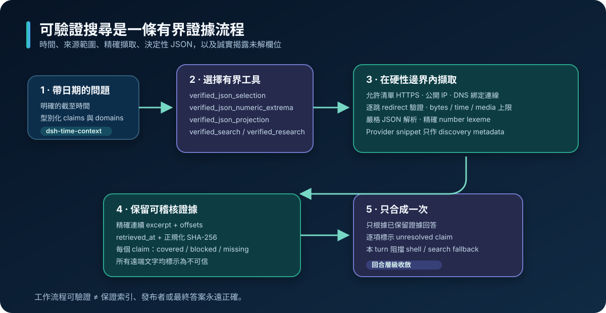
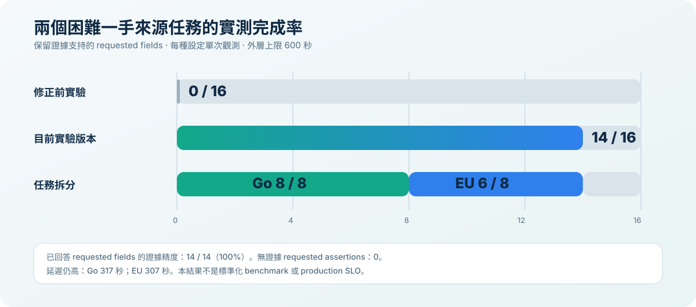

# dsh-plugin-verified-search

[](https://github.com/f0909172434/dsh-plugin-verified-search/actions/workflows/ci.yml)
[](https://github.com/f0909172434/dsh-plugin-verified-search/releases)
[](LICENSE)

[English](README.md) · [繁體中文](README.zh.md) · [简体中文](README.zh-CN.md)

**為 DeepSeek Harness 提供可稽核的現況來源檢索。**

此外掛會替換具搜尋能力 agent 繼承的 `web_search`，改用有界工作流程，讓來源範圍、保留證據、確定性的 JSON 選取與未解缺口都清楚可見。它是 [deepseek-harness Discussion #332](https://github.com/deepseek-ai/deepseek-harness/discussions/332) 的可安裝配套，也會掛載 [Discussion #344](https://github.com/deepseek-ai/deepseek-harness/discussions/344) 討論的時間上下文。

它驗證的是工作流程與 structured-source postcondition，**不會**認證 publisher 的內容必然正確，也不保證上游搜尋索引永遠最新。



## 發布狀態

| 產品線 | 安裝 ref | Model-facing 工具 | 驗證邊界 |
| --- | --- | --- | --- |
| 穩定版 | `v0.1.1` | `verified_search` | 維護者驗證的 release tag，包含套件 artifact、checksums、跨平台 CI、乾淨 profile 安裝與已記錄的真實 provider conformance |
| 實驗快照 | `c29b531a6c2e52200d454aa9ded42214ba8c0014` | 下列全部五個工具 | 2026-08-16 當時最後一個綠燈 `main` 快照；250 tests 與 42-case frozen offline corpus 全通過 |
| 移動中的 `main` | `main` | 未發布開發碼 | 不要在可重現測試中直接安裝；不同 commit 之間的行為與 generated artifacts 可能改變 |

> **外部獨立驗證：尚無。** Repository 提供內部 deterministic tests、CI、package reproducibility checks 與維護者執行的 conformance evidence；這些訊號不會被描述成第三方審查。

## 前置需求

- DeepSeek Harness `0.1.0-rc.6` 與 Cordis `4.0.1`。
- Node.js `22.19.x` 或 `24.x`。
- 透過 Harness credential service 或啟動環境提供 `DEEPSEEK_API_KEY`。
- 使用原本就有搜尋能力的 preset；此外掛不會替內建 `minimal` preset 擴權。
- CI 涵蓋 Ubuntu 與 Windows；macOS 目前不屬於正式支援契約。

更換 Harness、Cordis、Node 或 package-manager 版本前，請先閱讀[相容性契約](docs/COMPATIBILITY.md)。

## 一分鐘安裝

### 穩定版 `verified_search`

```powershell
dsh plugin --profile web add github:f0909172434/dsh-plugin-verified-search#v0.1.1
dsh --profile web --dump-config
dsh web
```

等價的單行 PowerShell 指令：

```powershell
dsh plugin --profile web add github:f0909172434/dsh-plugin-verified-search#v0.1.1; dsh --profile web --dump-config; dsh web
```

Release 已提交 prebuilt `lib/`，且沒有 install-time build script；固定 Git ref 安裝時，不會在使用者電腦上執行此 repository 的開發工具鏈。

### 五工具實驗快照

```powershell
dsh plugin --profile web add github:f0909172434/dsh-plugin-verified-search#c29b531a6c2e52200d454aa9ded42214ba8c0014
dsh --profile web --dump-config
dsh web
```

這個快照只適合開發與評估。需要可重現結果時，不要把明確 commit 改成會移動的 `main`。

如果 deployment 已掛載 Discussion #344 的 `time-context` row，請在啟動 Harness 前設定 `DSH_VERIFIED_SEARCH_DISABLE_TIME_CONTEXT=1`，避免重複的 clock injector。

### 回滾

```powershell
dsh plugin --profile web remove dsh-plugin-verified-search
dsh web
```

## 最小 quickstart

對具搜尋能力的 agent 提出有界、帶絕對日期的問題，例如：

> 找出截至 2026-08-14 的 DeepSeek 現行旗艦 API model。只使用 `api-docs.deepseek.com`。若保留來源沒有包含答案的 excerpt，請回報 unresolved，不要用記憶補答案。

對應的 model-facing `verified_search` arguments：

```json
{
  "query": "DeepSeek current flagship API model as of 2026-08-14",
  "allowed_domains": ["api-docs.deepseek.com"]
}
```

預期行為：

- 將原生 provider allowlist 傳給上游；
- 在本機依精確 hostname 或 subdomain 對回傳的 structured sources 再做 postfilter；
- credential-bearing URL 與敏感／追蹤 URL 元件會在組成 session-visible 結果前被拒絕或移除；
- 只有標題或 URL、卻沒有保留 citation excerpt 的來源，不會升格成已驗證證據；
- 證據缺口會保持可見，不會被舊答案或模型記憶取代。

需要獨立比較來源時，另做一次不限制 domain 的查詢。Allowlist 是「回傳 structured-source hostname」的 postcondition，不是 network-egress 或 privacy boundary。

## 選擇正確工具

| 工具 | 適合的任務 | 有界結果 |
| --- | --- | --- |
| `verified_search` | 單一、狹窄、會變動的事實查詢 | Structured-source hostname postfilter，citation excerpt 缺口保持可見 |
| `verified_research` | 多實體或多 claim 研究 | 每個 claim 的保留 excerpt、retrieval metadata、content hash 與明確 unresolved claims |
| `verified_json_selection` | 從官方 JSON feed 做 latest／as-of 選取 | 嚴格 RFC 6901、日期 cutoff、最大日期與全部 final ties |
| `verified_json_numeric_extrema` | JSON 的精確數值最大／最小值 | 直接比較 source lexeme、不經 IEEE-754，並保留全部 final ties |
| `verified_json_projection` | 依來源順序取得全部嚴格相符 JSON rows | 有界 parent／nested projection、可稽核 pointer repair、不推測排序語意 |

只有 `verified_search` 屬於穩定的 `v0.1.1`。其餘四個工具都屬於固定 `0.3.0-experiment.0` 快照中的實驗功能。

### 複合研究範例

```json
{
  "query": "Identify current flagship API model IDs as of 2026-08-14",
  "lanes": [
    {
      "id": "deepseek",
      "query": "DeepSeek current flagship API model ID as of 2026-08-14",
      "required_claims": [
        {
          "id": "model_id",
          "query": "latest DeepSeek flagship API model identifier",
          "evidence_must_include": ["Model ID"],
          "value_kind": "generic_text",
          "scope": {"kind": "document", "must_include": ["DeepSeek"]}
        }
      ],
      "allowed_domains": ["api-docs.deepseek.com"],
      "seed_urls": ["https://api-docs.deepseek.com/api/list-models/"],
      "gap_query": "site:api-docs.deepseek.com/api/list-models model IDs 2026-08-14"
    }
  ]
}
```

`evidence_must_include` 是正規化 substring postcondition，不是語意 entailment 裁判。不要把未知答案本身放進 required phrase，只為確認模型自己的猜測。

## 失敗行為

此外掛會 fail closed，或把狀態保持為明確 unresolved。

- 無效 hostname allowlist、credential-bearing URL、不安全 redirect、非 public resolved address、不支援 media、錯誤 charset 宣告、無效 UTF-8 與資源上限違規，都會產生可見失敗。
- Structured JSON 操作會拒絕無效 JSON、duplicate key、過深 nesting、無效 pointer、缺少欄位、不支援的 numeric projection、row／tie／output 超限，以及無法取得 exact number lexeme 的 runtime。
- Discovery 可略過已知 binary path；明確提供但不支援的 binary seed 會留下可見失敗，不會被靜默重新解讀。
- Provider 或 fetch timeout 會中止有界工作，並保留證據缺口。
- `allClaimsCovered`、`complete: true` 或 `truncated: false` 只描述宣告的有界操作；不證明來源新鮮度、語意 entailment、publisher authenticity、feed completeness 或 pagination 已耗盡。

## 信任與安全邊界

此外掛可以保證：本機過濾後回傳的 structured sources 符合明確 hostname allowlist。實驗版完整頁面 reader 另將擷取限制在有界 public HTTPS target，並執行 DNS/IP validation、pinned transport、redirect checks、text/JSON media 與 charset validation，以及 byte/time limits。

它**不能證明**：

- provider 的私有 candidate pool 或生成 prose 只使用 allowlist；
- provider 沒有自行擷取其他頁面或跟隨 allowlist 以外的 redirect；
- 上游索引一定含有最新頁面，或時間 ranking 正確；
- 保留的 phrase 已語意支持 claim，或能正確處理否定；
- caller 指定的 seed URL 一定 canonical、first-party 或 authoritative；
- API response 真實、完整、沒有 pagination、排序語意正確或事實正確；
- public page 的文字可安全當成指令執行。

Search query 會成為 durable Harness session data。不要把 secret、signed URL 或私人資料放進 query。私密回報與完整 threat boundary 請見 [SECURITY.md](SECURITY.md)。

## 驗證快照

固定的實驗快照記錄：

- source commit：`c29b531a6c2e52200d454aa9ded42214ba8c0014`；
- push CI：Ubuntu 與 Windows、Node `22.19.x` 與 `24.x` 全通過；
- HonestCI baseline：**250 tests**，0 failures、0 errors、0 skipped；
- frozen offline corpus：**42/42 cases**；
- registered offline result digest：`sha256:3002001da02d0b8501bcc97ee867109f1bfbf0e1a227d87845db81da658ea5c0`；
- committed `lib/` 與 package-content reproducibility checks；
- 外部獨立驗證：**尚無**。

Machine-readable 的 lifecycle、runtime、capability 與 architecture facts 位於 [`capabilities.json`](capabilities.json) 和 [`architecture.json`](architecture.json)。評估方法請見 [docs/OFFLINE_EVALUATION.md](docs/OFFLINE_EVALUATION.md)、[docs/PROPERTY_TESTING.md](docs/PROPERTY_TESTING.md) 與 [docs/HONEST_CI_DOGFOOD.md](docs/HONEST_CI_DOGFOOD.md)。

## 實測觀測



兩個 frozen-ledger live tasks 在 600 秒外層上限下得到以下單次觀測：

| 任務 | 修正前 | 實驗工作流程 | Terminal 時間 |
| --- | ---: | ---: | ---: |
| Go 支援 releases、security scope 與 Linux artifact provenance | 0/8 | **8/8** | 317 秒 |
| EU AI Act 修法時序與 GPAI 過渡期限 | 0/8 | **6/8** | 307 秒 |
| **合計** | **0/16** | **14/16（87.5%）** | — |

已回答的 14 個 requested fields 都有保留的官方來源證據；另外兩欄保持 unresolved。這些只是單次觀測，不是標準化 benchmark、統計估計、latency target 或 release guarantee。兩次成功 terminal run 都超過 240 秒，因此 timeout 與 latency 仍是重要改進方向。

## 設定

Bundle 可從 Harness credential service 或 launch environment 讀取 `DEEPSEEK_API_KEY`。可選設定包括：

| 類別 | Fields |
| --- | --- |
| Provider | `apiKeyEnv`、`apiKey`、`baseURL`、`model`、`apiVersion` |
| Search limits | `maxTokens`、`maxUses`、`maxResults`、`searchTimeoutMs` |
| Experimental research | `researchTimeoutMs`、`researchMaxResults` |

`researchMaxResults` 預設為 24，範圍 4–32，而且不得低於該次呼叫宣告的 claim count。設定變更屬於 compatibility 與 resource-boundary 變更，不只是效能調參。

## 開發與完整驗證

```powershell
pnpm install --frozen-lockfile --ignore-scripts
pnpm run check
pnpm test
pnpm run build
pnpm run evaluate:offline
npm pack --dry-run --ignore-scripts --json
git diff --check
git diff --exit-code -- lib
```

第二次 build 不得產生新的 `lib/` diff。Frozen offline digest 發生變化代表可能有行為改動；不要只為讓 CI 變綠就更新 expected digest。

## 文件

- [架構與 ownership boundaries](docs/ARCHITECTURE.md)
- [相容性契約](docs/COMPATIBILITY.md)
- [Frozen offline evaluation](docs/OFFLINE_EVALUATION.md)
- [Property-testing contract](docs/PROPERTY_TESTING.md)
- [HonestCI dogfooding evidence](docs/HONEST_CI_DOGFOOD.md)
- [單人串行維護 roadmap](docs/ROADMAP.md)
- [維護規則](MAINTENANCE.md)
- [安全政策](SECURITY.md)
- [變更紀錄](CHANGELOG.md)

## 與上游核心修復的關係

此 repository 是可部署的 compatibility layer。Provider-neutral Harness core change 仍位於 [`ce4d0455c`](https://github.com/f0909172434/deepseek-harness/commit/ce4d0455c637e5ba91fbb7b3a88725e7ec097371)。若官方專案發布等價的有界能力，此外掛可轉為額外驗證模式，或透過有文件的 migration path 退役。

## 安全回報

若懷疑有 credential leak、allowlist bypass 或 unsafe page-fetch path，請使用此 repository 的 GitHub private security-advisory interface。不要把 API key、signed URL、私人 query、私人 excerpt 或 raw session log 貼到 public issue。

## License

MIT
